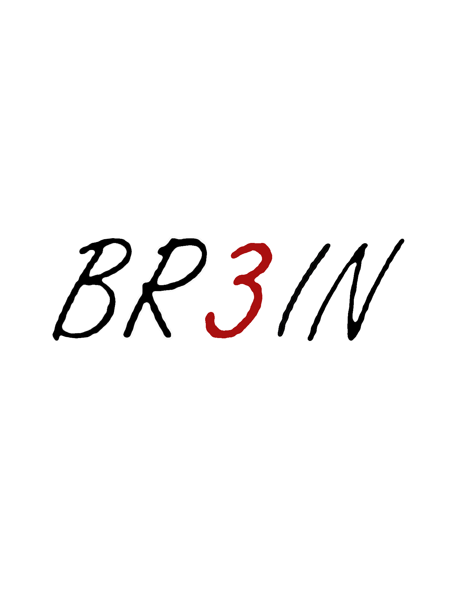

# FetalBio-AI

## Description

This work is a contribution presented at the **GNB 2025 Conference**, Palermo, Italy, from **June 16th to 18th**, titled **“FetalBio-AI: A Novel AI-Based Software for Fetal Biometry Estimation.”** The authors are **A. Sbrollini, M. Gjika, M. J. Mortada, M. AlKalet, and L. Burattini.**

Developed by **[BR3iN Group](https://br3in.dii.univpm.it/)**  
Biomedical Engineering Research & Innovation Network  🔗 [LinkedIn](https://www.linkedin.com/in/br3in-univpm-3825341a2/)

**FetalBio-AI** is an innovative AI-based software designed to automate the estimation of fetal head biometry from ultrasound images. With a user-friendly interface, it integrates a **U-Net model** for image segmentation, enabling the detection of the fetal head and computation of key biometric parameters, including **Biparietal Diameter (BPD)**, **Occipitofrontal Diameter (OFD)**, and **Head Circumference (HC)**. Additionally, FetalBio-AI tracks both maternal and fetal clinical data. The software was validated using the open-access **HC18 Grand Challenge dataset**.

FetalBio-AI holds significant potential for scalability, making it a promising tool for future applications in fetal monitoring.

## Characteristics

- **AI-Powered Image Segmentation and Analysis**: Implementation of the **U-Net model** using **TensorFlow** and **OpenCV**.
- **User-Friendly Interface**: Developed using **PySide6** and **Qt Designer**.
- **Exportable Reports**: Produce reports containing both maternal and fetal clinical data along with the estimated biometric data in `.txt` format. It also saves a `.PNG` image of the ultrasound with the overlaid HC measurement.
- **Scalability**: Designed to support additional biometric data, such as femur length, in future updates.

## Installation

### Prerequisites

- **Python 3.10**
- Required dependencies listed in `requirements.txt`

### Steps

1. Clone the repository to your local machine 
    ```sh
     git clone https://github.com/BME-Jafar/FetalBio-AI/
    ```
2. Open **Command Prompt** and navigate to the extracted folder.
3. If the required dependencies are not installed, use the following command:
    ```sh
    pip install -r requirements.txt
    ```
4. Once the dependencies from `requirements.txt` are installed successfully, run the main application with the following command:
    ```sh
    python mainwindow.py
    ```
5. The **FetalBio-AI** GUI will launch. From this point, you can begin using it to obtain fetal biometry estimations.

## Usage

1. **Register a New Subject**:
   - Click on the **"New Subject"** button to open a panel where you can input clinical data for both the mother and the fetus.
   - **Note**: Mandatory clinical data will appear on the top panel during the analysis.

2. **Load an Ultrasound Image**:
   - Click on the **"Load Image"** button to select the `.DCM` ultrasound image from your PC.
   - Once the image is loaded, it will appear in the right panel, and pixel size information will be automatically extracted.

3. **Make Prediction**:
   - Click on the **"Make Prediction"** button to begin the analysis.
   - The software will output the **BPD**, **OFD**, and **HC** values, and overlay the HC measurement on the ultrasound image.

4. **Save Reports**:
   - Click on the **"Save Prediction"** button to save the estimated biometric data and clinical data in a `.txt` file.
   - The ultrasound image with the overlaid HC measurement will be saved as a `.PNG` file.

## Citation

If you use **FetalBio-AI** in your research or application, please cite both the **conference paper** and the **software repository**:

**1. Conference Paper**  

> Sbrollini, A., Gjika, M., Mortada, M. J., AlKalet, M., & Burattini, L. (2025). **FetalBio-AI: A Novel AI-Based Software for Fetal Biometry Estimation.** Presented at the *GNB 2025 Conference*, Palermo, Italy.


**2. Software Repository:**

> Sbrollini, A., Gjika, M., Mortada, M. J., AlKalet, M., & Burattini, L. (2025). FetalBio-AI: Software for Fetal Biometry Estimation [Computer software]. Retrieved from https://github.com/BME-Jafar/FetalBio-AI 

<p align="right" style="margin-bottom:0;">
  
</p>

---

## License

This project is licensed under the [MIT License](LICENSE).  
You are free to use, modify, and distribute it, provided that proper credit is given.
